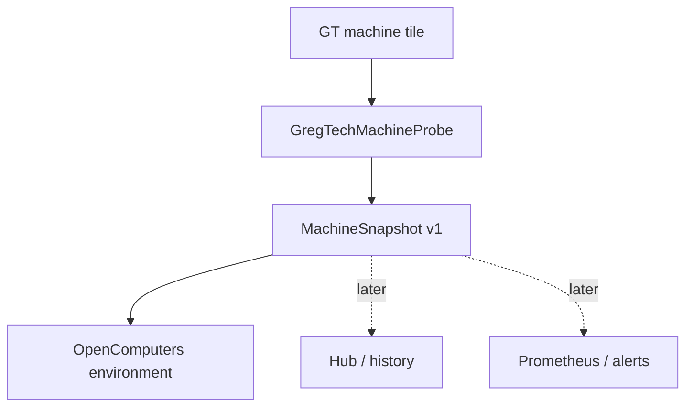

# GregScope Telemetry Mod — Engineering Handoff

**Status:** implementation-ready plan for v0.1  
**Target:** GregTech: New Horizons 2.9.0-beta-3 / Minecraft 1.7.10  
**Prepared:** 2026-09-16  
**Working name:** GregScope  
**Working Forge mod ID / Java package:** `gregscope` / `io.github.ldogg123.gregscope`

> The project namespace uses the GitHub account `Ldogg123`. The mod name is still provisional, but choose it before publishing a first build. Renaming a mod ID after worlds begin using its items or blocks becomes painful.

## 1. Product summary

GregScope is a read-only industrial observability mod for GTNH. It should answer questions such as:

- Is this machine running, disabled, unformed, starved, blocked, or simply idle?
- How far through the current operation is it?
- How much EU/t is it using, and how much energy is buffered?
- What stopped a multiblock?
- How many maintenance problems does it have?
- How often does it run, stall, or complete work over time?

The mod must **measure and explain** factory behavior without increasing production, bypassing progression, scanning the whole world, or controlling machines by default.

The long-term product is a GTNH-native equivalent of parts of Prometheus, Grafana, and Alertmanager:

1. normalized machine telemetry;
2. deliberately placed sensors and a Telemetry Hub;
3. item/fluid/power flow measurement;
4. history and dashboards;
5. optional Prometheus export;
6. optional alerts and TaskNH integration.

The first release is intentionally smaller: a safe OpenComputers driver that exposes normalized snapshots from adjacent GT singleblocks and multiblock controllers. This validates the data model before adding blocks, covers, persistence, networking, and UI.

## 2. Locked technical baseline

Build and test against these versions—not current `master` versions of the mods.

| Component | Beta-3 version | Source revision used for this handoff |
|---|---:|---|
| Minecraft | 1.7.10 | — |
| Forge | 10.13.4.1614 | ExampleMod baseline |
| GT5-Unofficial | 5.09.54.133 | `74150cf3b624e504fd72746606317a3f5b423667` |
| OpenComputers | 1.12.61-GTNH | `18c66d3e2fe0127c91f478fe43d6ef5354f2cd7a` |
| GTNHLib | 0.11.46 | beta-3 manifest |
| ModularUI2 | 2.3.88-1.7.10 | beta-3 manifest; not needed by v0.1 |
| ExampleMod1.7.10 | current starter baseline | `2cc3ce4e862ddcb2943312038fe9a3a7ab42c19d` |

The beta-3 manifest does **not** contain TaskNH. TaskNH `master` at the time of research requires GTNHLib 0.11.47+, so do not add it to a stock beta-3 development instance yet.

## 3. Source findings that shape the design

These are facts verified against the pinned sources above.

### 3.1 GT already exposes a useful common baseline

`IGregTechTileEntity` inherits machine progress and energy interfaces. A valid GT machine holder exposes:

- `getMetaTileEntity()` and `getMetaTileID()`;
- `getProgress()` and `getMaxProgress()`;
- `isActive()` and `isAllowedToWork()`;
- `wasShutdown()` and `getLastShutDownReason()`;
- stored/capacity EU and voltage/amperage information.

Shutdown reasons have both a stable registry ID and a human-readable display string. The ID is suitable for automation; the display string is only a convenience because it is localized.

### 3.2 Beta 3 multiblocks have structured information

`MTEMultiBlockBase#getInfoMap()` returns string-encoded values for:

- progress and maximum progress;
- energy stored and capacity across energy hatches;
- actual and maximum energy usage;
- minimum energy tier;
- maintenance issue count;
- efficiency;
- pollution.

`MTEMultiBlockBase` also publicly exposes or provides getters for:

- whether the structure is formed (`mMachine`);
- current recipe-check result and its stable ID;
- recipes completed (`recipesDone`);
- total runtime and last-working tick;
- repair and ideal maintenance status.

This is enough for a valuable multiblock snapshot without a mixin.

### 3.3 Basic machines expose useful state, but less structured detail

`MTEBasicMachine` provides public progress, maximum progress, EU/t, output-blocked ticks, and an `isStuttering()` getter. The active recipe is stored in protected `mLastRecipe`, so v0.1 must not promise recipe identity.

For basic machines:

- `mOutputBlocked > 0` is a useful output blockage signal;
- `isStuttering()` is the existing power/steam starvation indication;
- `mEUt` is usable for current consumption;
- there is no equivalent public persistent recipes-completed counter.

### 3.4 OpenComputers drivers compose

OpenComputers already registers a GT energy-container driver named `gt_energyContainer`. Its driver registry combines all matching block drivers into a compound environment rather than choosing only one.

Therefore GregScope may register a second `DriverSidedTileEntity` safely. Give its environment the preferred component name `gt_machine` and a priority greater than the existing energy driver's `-1`. The resulting proxy should expose both GregScope callbacks and the existing energy callbacks. This coexistence must be covered by an integration test.

OpenComputers requires drivers to be registered during Forge **init**, not pre-init or post-init.

### 3.5 TaskNH is promising, but not yet a stable integration target

TaskNH has public storage classes, but it currently lacks a small supported server-side facade for third-party task creation, deduplication, team lookup, and synchronization. Directly calling its storage and packet internals would create tight coupling.

Before GregScope integrates with TaskNH, prefer one of these:

1. contribute a small public TaskNH service/API upstream; or
2. coordinate a supported event/IMC message contract with TaskNH maintainers.

Do not use reflection into TaskNH internals as the production design.

## 4. v0.1 scope

### Included

- A new Forge mod built from the GTNH ExampleMod starter.
- A read-only OpenComputers block driver for:
  - `MTEBasicMachine`;
  - `MTEMultiBlockBase`.
- A normalized `MachineSnapshot` independent of OpenComputers.
- One primary OC callback, `getSnapshot()`.
- Small convenience callbacks only if they delegate to the same snapshot code.
- Pure unit tests for state classification and numeric parsing.
- Dedicated-server smoke testing and an in-game Lua example.

### Explicitly excluded

- Covers, blocks, recipes, or a GUI.
- Background sampling or persistent history.
- Item/fluid throughput.
- Network-wide power accounting.
- Active recipe identification.
- Current parallel count.
- Machine control, enable/disable, inventory access, or redstone control.
- Prometheus, HTTP listeners, alerts, and TaskNH.
- Mixins, access transformers, reflection, or edits to GT5U/OpenComputers.
- World scans or forced chunk loading.

This boundary is important: v0.1 should be useful, reviewable, and easy to remove from a world because it adds no GregScope blocks, items, or standalone `WorldSavedData`. OpenComputers may still retain harmless component-node metadata inside an Adapter's own NBT while the driver is installed.

## 5. Architecture



The core rule is that integration layers consume `MachineSnapshot`; they do not each inspect GT internals independently.

Suggested source tree:

```text
src/main/java/io/github/ldogg123/gregscope/
├── GregScope.java
├── CommonProxy.java
├── model/
│   ├── MachineKind.java
│   ├── MachineState.java
│   └── MachineSnapshot.java
├── probe/
│   ├── MachineProbe.java
│   ├── GregTechMachineProbe.java
│   ├── SnapshotBuilder.java
│   └── StateClassifier.java
└── integration/opencomputers/
    ├── GregTechMachineDriver.java
    └── GregTechMachineEnvironment.java

src/test/java/io/github/ldogg123/gregscope/
├── probe/StateClassifierTest.java
└── probe/SnapshotParsingTest.java
```

Use ordinary final classes and Java collections. Do not use records or newer runtime-library APIs merely because Jabel permits newer syntax; the produced mod still targets a Java 8-era game stack.

## 6. Snapshot schema v1

`getSnapshot()` returns a Lua table converted from a deterministic `LinkedHashMap<String, Object>`. Do not return GT objects, `ItemStack`, `FluidStack`, NBT, or localized chat components.

### Always-present fields

| Key | Type | Meaning |
|---|---|---|
| `schemaVersion` | integer | Always `1` for this contract. |
| `kind` | string | `singleblock` or `multiblock`. |
| `state` | string | Stable normalized state listed below. |
| `name` | string | Human-readable machine name in the server locale. |
| `metaName` | string | GT meta-tile name; preferred programmatic identity. |
| `metaId` | integer | GT meta-tile ID. |
| `machineClass` | string | Fully qualified MTE class, useful for diagnostics. |
| `dimension` | integer | Dimension ID. |
| `x`, `y`, `z` | integer | Controller/singleblock location. |
| `active` | boolean | GT visible active state. |
| `allowedToWork` | boolean | Whether working is enabled. |
| `hasThingsToDo` | boolean | Whether GT reports progress/work pending. |
| `wasShutdown` | boolean | Whether GT recorded a forced shutdown. |
| `progressTicks` | integer | Raw current progress; preserve negative GT values. |
| `maxProgressTicks` | integer | Raw required progress. |
| `progress` | number | Clamped `0.0..1.0`; `0.0` if max progress is not positive. |
| `statusId` | string | Stable detailed reason, or `none`. |
| `statusText` | string | Human-readable server-localized reason. Never use for automation. |

### Optional capability fields

Only add these when the source supports them. Lua callers must check for presence.

| Key | Source |
|---|---|
| `euPerTick` | Basic machine `mEUt`; multiblock `energyUsage` from `getInfoMap()`. Positive means consumption; negative means generation. |
| `energyStored`, `energyCapacity` | Tile energy methods for basic machines; multiblock info map for energy hatches. |
| `formed` | Multiblock `mMachine`. |
| `maintenanceIssues` | Multiblock info map or ideal minus repair status. |
| `efficiency` | Multiblock info map, normalized `0.0..1.0`. |
| `pollutionRatio` | Multiblock info map. |
| `recipesCompleted` | Multiblock `recipesDone`. |
| `runtimeTicks` | Multiblock total runtime. |
| `ticksSinceLastWork` | Total runtime minus last-working tick, never below zero. |
| `recipeCheckResultId` | Multiblock check result ID. |
| `recipeCheckResultText` | Human-readable check result. |
| `outputBlockedTicks` | Basic machine `mOutputBlocked`. |
| `stuttering` | Basic machine `isStuttering()`. |
| `warnings` | Array of stable warning IDs, initially `maintenance`. |

Do not insert Java `null` values into the map. Omit unsupported optional keys.

## 7. Normalized state rules

Evaluate rules in this order. The exact reason remains in `statusId`; `state` is intentionally coarse and stable.

| Priority | Condition | `state` | `statusId` source |
|---:|---|---|---|
| 1 | Tile/MTE is missing or invalid | `unavailable` | `machine_unavailable` |
| 2 | `wasShutdown()` | `shutdown` | shutdown reason ID |
| 3 | not allowed to work | `disabled` | `disabled` |
| 4 | multiblock is not formed | `unformed` | `structure_incomplete` |
| 5 | basic machine is stuttering | `power_starved` | `power_or_steam_starved` |
| 6 | basic output-blocked ticks > 0, or multiblock result is `item_output_full` / `fluid_output_full` | `output_blocked` | exact source ID |
| 7 | active | `running` | `running` |
| 8 | inactive multiblock has a nontrivial failed recipe-check result | `waiting` | exact recipe-check result ID |
| 9 | otherwise | `idle` | `none` or current benign result |

Maintenance issues are warnings unless GT actually shuts the machine down with `no_repair`. A machine may continue operating with some maintenance problems, so do not mislabel every imperfect machine as stalled.

Treat `none`, `success`, `generating`, and `cycle_idle` as benign when the machine is inactive. Preserve unfamiliar future result IDs as `state=waiting` instead of hard-failing.

## 8. Safe extraction rules

Keep all GT-version-specific access in `GregTechMachineProbe`.

1. Validate `IGregTechTileEntity#canAccessData()` and `getMetaTileEntity()` before every snapshot.
2. Support only `MTEBasicMachine` and `MTEMultiBlockBase` in v0.1. Exclude pipes, cables, hatches, storage blocks, and unrelated GT tile holders.
3. For multiblock numeric fields, parse `getInfoMap()` with helpers such as `longOrDefault` and `doubleOrDefault`. A malformed or missing key must omit a field, not crash the server.
4. Use stable reason IDs for logic. Catch exceptions while obtaining display strings and fall back to the ID.
5. Clamp only the derived progress ratio. Preserve raw progress because GT documents that it can be negative.
6. Do not parse `getInfoData()` text. It is display-oriented, translated, and unsuitable as an API.
7. Do not access protected fields through reflection.
8. Do not cache a tile entity globally. The OC environment may hold its adjacent tile for its own lifetime, but every callback must revalidate it because chunks and blocks change.
9. Do not touch a `World` from a non-server thread.

## 9. OpenComputers contract

### Driver

`GregTechMachineDriver` should extend `li.cil.oc.api.prefab.DriverSidedTileEntity`.

- `getTileEntityClass()` returns `IGregTechTileEntity.class`.
- Override `worksWith(...)` to call the superclass and then require an MTE of type `MTEBasicMachine` or `MTEMultiBlockBase`.
- `createEnvironment(...)` returns `null` if the target changed or became invalid.
- Register it with `li.cil.oc.api.Driver.add(...)` in `FMLInitializationEvent`.

### Environment

Use the public `li.cil.oc.api.prefab.ManagedEnvironment` base rather than extending an OpenComputers internal integration helper.

- Create a network-visible component node named `gt_machine`.
- Implement `NamedBlock`.
- `preferredName()` returns `gt_machine`.
- `priority()` returns `10`, intentionally higher than OC's existing GT energy environment priority of `-1`.
- Leave callbacks synchronous (`direct = false`) because they inspect live server state.

### Required callback

```java
@Callback(doc = "function():table -- Returns a normalized read-only GT machine telemetry snapshot.")
public Object[] getSnapshot(Context context, Arguments args)
```

Return:

```java
new Object[] { snapshot.toMap() };
```

If the target is unavailable, use the normal OC soft-error convention:

```java
new Object[] { null, "machine unavailable" };
```

Do not expose mutating callbacks in v0.1.

### Lua smoke test

```lua
local component = require("component")
local machine = component.gt_machine

local snapshot, err = machine.getSnapshot()
if not snapshot then
  error(err)
end

for key, value in pairs(snapshot) do
  print(key, value)
end
```

Also verify that existing callbacks such as `getStoredEU()` remain available through the combined proxy. That proves the new driver composes with OC's existing GT integration.

## 10. Project bootstrap

Use the downloadable **starter ZIP** from `GTNewHorizons/ExampleMod1.7.10`; its README explicitly advises new mods not to fork or clone the example repository itself.

Recommended `gradle.properties` values:

```properties
modName = GregScope
modId = gregscope
modGroup = io.github.ldogg123.gregscope
useModGroupForPublishing = true
minecraftVersion = 1.7.10
forgeVersion = 10.13.4.1614
channel = stable
mappingsVersion = 12
enableModernJavaSyntax = jabel
usesMixins = false
```

Initial `dependencies.gradle`:

```groovy
dependencies {
    implementation("com.github.GTNewHorizons:GT5-Unofficial:5.09.54.133:dev")
    implementation("com.github.GTNewHorizons:OpenComputers:1.12.61-GTNH:dev")
}
```

The artifacts and `dev` classifiers above exist in the GTNH Maven repository. If Gradle resolves a transitive version newer than the beta-3 manifest, add explicit constraints matching beta 3 rather than allowing silent drift.

The main mod annotation should include:

```java
dependencies = "required-after:gregtech;required-after:OpenComputers"
```

Recommended license: MIT. Keep the repository public if eventual GTNH inclusion is a goal.

## 11. Initial implementation tickets

### GS-001 — Bootstrap the mod

Deliverables:

- initialize from the ExampleMod starter;
- replace all example identifiers and classes;
- add pinned GT5U and OC dependencies;
- add MIT license, README, and `.gitignore`;
- confirm `./gradlew build` passes;
- retain the template's CI and dedicated-server smoke test.

Acceptance criteria:

- no example package names remain;
- no mixins or access transformers are enabled;
- the jar loads with the exact beta-3 dependency set.

### GS-002 — Implement the normalized snapshot core

Deliverables:

- `MachineKind`, `MachineState`, and immutable `MachineSnapshot`;
- `GregTechMachineProbe` for basic and multiblock machines;
- deterministic map serialization;
- state classifier following Section 7;
- defensive numeric parsing helpers.

Acceptance criteria:

- core code has no OpenComputers imports;
- optional keys are omitted rather than set to null;
- unknown recipe-check IDs are preserved;
- state-classifier and parser unit tests pass.

### GS-003 — Add the OpenComputers driver

Deliverables:

- driver registered during Forge init;
- environment named `gt_machine` with priority `10`;
- `getSnapshot()` callback and soft-error behavior;
- no direct callbacks and no mutating methods.

Acceptance criteria:

- an adjacent OC Adapter sees a `gt_machine` component;
- `getSnapshot()` returns schema version 1;
- the existing GT energy callbacks remain callable;
- breaking/removing the target block does not crash the server.

### GS-004 — Integration validation and documentation

Test at minimum:

| Machine | Conditions |
|---|---|
| MV/HV basic machine | idle, running, disabled, starved of power, output blocked |
| Electric Blast Furnace | unformed, formed/idle, running, maintenance warning, output full, power-loss shutdown, manually disabled |
| OC Adapter | attach, detach, chunk unload/reload, server restart |
| Dedicated server | startup smoke test with no client classes loaded server-side |

Document:

- installation;
- OC Adapter placement;
- schema v1 and state meanings;
- sample Lua script;
- known omissions: recipe name, parallels, and history.

## 12. Definition of done for v0.1

v0.1 is done when all of the following are true:

- [ ] Builds reproducibly with pinned beta-3 dependencies.
- [ ] Starts on a dedicated server.
- [ ] Adds no blocks, items, recipes, GregScope-owned saved data, mixins, or global tick handlers.
- [ ] Supports both a normal GT basic machine and a GT multiblock controller.
- [ ] Correctly distinguishes shutdown, disabled, unformed, stuttering, output-blocked, running, waiting, and idle in the documented test cases.
- [ ] Returns stable reason IDs and never requires consumers to parse localized text.
- [ ] Coexists with OC's `gt_energyContainer` driver.
- [ ] Survives target removal and chunk reload without exceptions.
- [ ] Includes a working Lua example and schema documentation.
- [ ] Has no measurable idle cost when nobody calls the component.

### Definition of done for v0.2 (added by GS-120)

v0.2 keeps every v0.1 guarantee except the two it deliberately lifts (it now adds blocks, items, recipes and saved
data, and it does periodic work), and adds:

- [ ] Unit and Horizon-QA suites green inside the CI step, on a **fresh** world.
- [ ] Transparency tests prove a covered face still passes items, fluids, EU and redstone, and that the sensor never
      writes to a machine.
- [ ] No mixins, no access transformers and no reflection in shipped code (reflection is allowed in tests).
- [ ] Tests prove GregScope never loads a chunk or a dimension.
- [ ] The per-tick sampling budget and the memory and disk ceilings are enforced and visible in `/gregscope stats`.
- [ ] Sensor identity survives the machine being broken and replaced, a chunk reload and a restart.
- [ ] Access rules hold at every entry point, including a client-to-server GUI open that never touches the block.
- [ ] Removing the mod leaves the world loadable and the machines intact.
- [ ] Every config key, NBT key and OpenComputers callback appears in the documentation (`DocsCoverageTest`).
- [ ] The GS-121 manual client checklist is signed off by a human.

## 13. Performance and safety budgets

- v0.1 performs no periodic work. A snapshot is built only when an OC caller asks for it.
- A multiblock snapshot may iterate its energy hatches through `getInfoMap()`, but it must not scan blocks or chunks.
- Never force-load a chunk for telemetry.
- Never retain unbounded time series, labels, machine names, or item IDs.
- Keep the API read-only. Machine control can be considered separately with explicit permissions and redstone-equivalent balance constraints.
- Log invalid targets at debug level at most; normal block removal is not an error.
- Avoid per-call INFO logging.

### Budget for v0.2 (added by GS-120; replaces "v0.1 performs no periodic work")

v0.2 samples, so the "no periodic work" rule is replaced by a bounded one:

- One server-tick handler. Each LIVE sensor is sampled every `sampling.intervalTicks` (20, 40, 60 or 100), spread
  across ticks rather than all in one.
- `sampling.tickBudgetMicros` (default 1000 us) is a **hard** per-tick cap. When a cycle would exceed it the rest is
  deferred to the next tick; the tick is never made longer to finish sampling.
- Sensors past `limits.maxSensors` or `limits.maxSensorsPerTeam` are not sampled at all.
- Disk writes go to a bounded queue (`history.ioQueueCapacity`) drained by one I/O thread. When it is full, writes
  are **dropped and counted**, never blocked on, so a slow disk cannot stall the server thread.
- Memory is bounded by construction: 24 h of history is a fixed 1,440-slot ring per sensor, and a history file is a
  fixed 92,224 B. Neither grows with uptime.
- Still true from v0.1: never force-load a chunk, never retain unbounded time series or labels, no per-call INFO
  logging, and normal block removal is not an error.

## 14. Roadmap after v0.1

### v0.2 — Sensor identity, Telemetry Hub, and history

- Add deliberately placed machine sensors/covers.
- Give each sensor a persistent UUID and user label.
- Sample loaded, registered sensors once per second by default—not every tick.
- Add a server-authoritative Telemetry Hub using ModularUI2.
- Start with bounded ring buffers, for example:
  - 300 one-second samples (5 minutes);
  - 1,440 one-minute aggregates (24 hours).
- Store only explicitly instrumented endpoints.
- Expose the same schema through the Hub and OC.

Before implementation, define removal behavior, chunk-unload behavior, team/owner permissions, and storage migration/versioning.

### v0.3 — Item and fluid flow meters

Do a design spike first. Tank-level deltas are **not** reliable throughput measurements because simultaneous input and output can cancel each other.

Candidate approaches:

1. an active pump/conveyor-style cover that performs and counts the transfer itself;
2. a narrowly scoped hook/mixin at the actual GT pipe transfer boundary;
3. explicit instrumented input/output hatches.

Compare correctness, interaction with existing covers, directionality, tick cost, and pack-review acceptability. Do not ship a passive “flow meter” that merely samples inventory deltas and labels the result as true flow.

### v0.4 — Prometheus exporter

- Disabled by default.
- Bind to `127.0.0.1` by default; require explicit configuration for other interfaces.
- HTTP thread reads immutable snapshots only and never touches a Minecraft `World`.
- Prometheus retains history; GregScope exports current gauges and monotonic counters.
- Avoid high-cardinality labels. Use explicit sensor ID/name, machine type, and dimension; do not turn arbitrary inventory contents into labels.
- Include health/build-info metrics and a scrape-time budget.

### v0.5 — Alerts and TaskNH

- Add threshold/duration rules with hysteresis, debounce, and recovery transitions.
- Deduplicate incidents by `(ruleId, sensorId)`.
- Start with chat and OC signals.
- For TaskNH, first obtain a supported API for server-side task create/update/close and team synchronization.
- Keep the integration optional and version-gated.
- A recovery should close or annotate the same incident task, not create a second task.

## 15. Important unresolved questions

These do not block v0.1.

1. **Final name:** GregScope, NHControl, or GTNH Instruments?
2. **Progression:** at what tier should physical sensors and the Hub become craftable?
3. **Ownership:** player-owned sensors, GTNHLib team-owned sensors, or both?
4. **Recipe identity:** should GregScope request a stable upstream GT5U getter rather than add a mixin?
5. **Parallel count:** same upstream-API question as recipe identity.
6. **Flow semantics:** count attempted transfer, accepted transfer, or both?
7. **History retention:** world-save NBT, separate files, or only external Prometheus retention?
8. **Official-pack ambition:** private server addon first, or design immediately for GTNH review?

The recommended answers for now are: keep the name provisional, target EV for the first physical Hub, use teams when GTNHLib integration arrives, and prefer upstream read-only getters over mixins.

### Answers as of v0.2 (added by GS-120)

Seven of the eight are now decided by what v0.2 actually shipped, not by preference.

1. **Final name:** still **GregScope**, still provisional. Nothing outside the repo depends on it yet; the mod id
   `gregscope` is what would be expensive to change, because it is baked into OpenComputers component names, the
   config path and the world folder.
2. **Progression:** **MV for the Machine Sensor, EV for the Telemetry Hub.** The sensor is cheap on purpose - you
   want one per machine - and the Hub is the tier gate.
3. **Ownership:** **both.** A sensor records the player who attached it, and access extends to that player's GTNHLib
   team. An unowned sensor (placed by a robot, say) is visible only to operators.
4. **Recipe identity:** **not needed, and no mixin was added.** GT's own `CheckRecipeResult` and `ShutDownReason`
   carry stable keys, read through their public API. This question can be closed.
5. **Parallel count:** **still open**, and still not worth a mixin. It is not in v0.2's snapshot.
6. **Flow semantics:** **both**, decided in `design-v0.3.md` - attempted and accepted are counted separately,
   because the gap between them is exactly what tells you a line is backed up. Not implemented in v0.2.
7. **History retention:** **separate files**, one fixed-size `.gsh` per sensor under `<world>/gregscope/`, not
   world-save NBT. Fixed size means bounded memory and disk, in-place slot writes, and a file a third party can read;
   see `history-format-v1.md`. External Prometheus retention (v0.4) sits on top rather than replacing it.
8. **Official-pack ambition:** **private server addon first.** v0.2 was nevertheless built to GTNH's conventions
   throughout - no mixins, no ATs, no shipped reflection, Spotless and Checkstyle in CI, Horizon-QA in-game tests -
   so that submitting it later is a review, not a rewrite.

## 16. Instructions for the first coding-agent session

Give Claude Code or Codex this document plus the following request:

```text
Implement only GS-001 and GS-002 from the GregScope handoff.

Target GTNH 2.9.0-beta-3 exactly. Use the GTNH ExampleMod starter rather than
forking the example repository. Pin GT5-Unofficial 5.09.54.133 and
OpenComputers 1.12.61-GTNH. Do not add mixins, access transformers, reflection,
blocks, items, saved data, or a tick handler.

Keep the core snapshot model independent of OpenComputers. Implement defensive
GT machine probing for MTEBasicMachine and MTEMultiBlockBase, deterministic map
serialization, and unit tests for state priority and numeric parsing. Run the
build and tests. Stop after reporting the resulting file tree, test results,
and any mismatch you found between the handoff and the pinned APIs.
```

Then use a second session for GS-003. Separating the sessions makes it easier to review the data contract before exposing it as a public OC API.

## 17. Primary references

- [GTNH 2.9.0-beta-3 manifest (pinned DreamAssemblerXXL revision)](https://github.com/GTNewHorizons/DreamAssemblerXXL/blob/0734e5250abf0fa6382b2fb6405a9e8eec0a2e54/releases/manifests/2.9.0-beta-3.json)
- [GTNH ExampleMod1.7.10 (reviewed revision)](https://github.com/GTNewHorizons/ExampleMod1.7.10/tree/2cc3ce4e862ddcb2943312038fe9a3a7ab42c19d)
- [GT5U `IMachineProgress` at 5.09.54.133](https://github.com/GTNewHorizons/GT5-Unofficial/blob/74150cf3b624e504fd72746606317a3f5b423667/src/main/java/gregtech/api/interfaces/tileentity/IMachineProgress.java)
- [GT5U `BaseMetaTileEntity` at 5.09.54.133](https://github.com/GTNewHorizons/GT5-Unofficial/blob/74150cf3b624e504fd72746606317a3f5b423667/src/main/java/gregtech/api/metatileentity/BaseMetaTileEntity.java)
- [GT5U `MTEBasicMachine` at 5.09.54.133](https://github.com/GTNewHorizons/GT5-Unofficial/blob/74150cf3b624e504fd72746606317a3f5b423667/src/main/java/gregtech/api/metatileentity/implementations/MTEBasicMachine.java)
- [GT5U `MTEMultiBlockBase` at 5.09.54.133](https://github.com/GTNewHorizons/GT5-Unofficial/blob/74150cf3b624e504fd72746606317a3f5b423667/src/main/java/gregtech/api/metatileentity/implementations/MTEMultiBlockBase.java)
- [GT5U recipe-check result contract](https://github.com/GTNewHorizons/GT5-Unofficial/blob/74150cf3b624e504fd72746606317a3f5b423667/src/main/java/gregtech/api/recipe/check/CheckRecipeResult.java)
- [OpenComputers driver API at 1.12.61-GTNH](https://github.com/GTNewHorizons/OpenComputers/blob/18c66d3e2fe0127c91f478fe43d6ef5354f2cd7a/src/main/java/li/cil/oc/api/detail/DriverAPI.java)
- [OpenComputers compound block driver](https://github.com/GTNewHorizons/OpenComputers/blob/18c66d3e2fe0127c91f478fe43d6ef5354f2cd7a/src/main/scala/li/cil/oc/server/driver/CompoundBlockDriver.scala)
- [Existing OpenComputers GT energy driver](https://github.com/GTNewHorizons/OpenComputers/blob/18c66d3e2fe0127c91f478fe43d6ef5354f2cd7a/src/main/scala/li/cil/oc/integration/gregtech/DriverEnergyContainer.java)
- [TaskNH reviewed revision](https://github.com/GTNewHorizons/TaskNH/tree/7c933c2e240b4eb18cad452bbfa61dd79265e144)

---

### Handoff decision record

- **Decision:** ship an OC-only, on-demand, read-only v0.1.  
  **Reason:** it validates the hardest reusable part—the normalized machine-state model—with almost no world or performance risk.

- **Decision:** no active recipe or parallel count in v0.1.  
  **Reason:** the pinned GT5U version does not expose both cleanly through a stable public read-only interface.

- **Decision:** no cover or Hub in v0.1.  
  **Reason:** those add registration, recipes, persistence, sync, UI, ownership, and migration before the telemetry semantics are proven.

- **Decision:** TaskNH integration is later and API-led.  
  **Reason:** current version skew and lack of a supported third-party service facade make immediate coupling brittle.

- **Decision:** Prometheus reads immutable cached snapshots in a later release.  
  **Reason:** HTTP worker threads must never inspect Minecraft world state directly.


---

## 18. Dependency bump checklist (GS-119)

GregScope pins GTNH **2.9.0-beta-3** (GT5U 5.09.54.133, OpenComputers 1.12.61-GTNH, GTNHLib 0.11.46, ModularUI2
2.3.88-1.7.10) through constraints in `dependencies.gradle`. Most coupling is checked by the compiler, so a bump that
renames or removes something GregScope calls fails `compileJava` and needs no ceremony. This checklist is for the
breakages a **green compile hides**. Run it on every GT, ModularUI2 or GTNHLib bump.

1. **Run `GtApiShapeTests`** (in-game, `gregscope.api.shape`):
   `./gradlew runServer --mcJvmArgs=-Dhorizonqa.mode=ci --mcJvmArgs=-Dhorizonqa.tests=io.github.ldogg123.gregscope.gametest.GtApiShapeTests`
   It fails loudly, with the old and new shape, on each of the following.
2. **A `lets*` method GT added to `Cover`.** This is the one that matters most and the only one no other test can
   catch. Design section 1.4 promises a covered face stays transparent, and that promise is kept by overriding
   *every* `lets*` and returning true. A ninth one appearing means GregScope silently inherits GT's default and a
   covered face stops passing something. `SensorCoverTests.transparentTo{Energy,Items,Fluids,Redstone}` prove the
   behaviour for the four resource types that exist today - they would also catch an override being *deleted* - but
   they cannot notice a resource type GT invents. **Fix:** override the new method, return the permissive value, add a
   behavioural transparency test for it, then update `EXPECTED_LETS_METHODS`.
3. **`gregtech.common.covers.Cover` moving package.** It is not an API class and carries no compatibility promise
   (design section 18). All coupling to it is deliberately confined to `MachineSensorCover` and `SensorCovers`.
4. **`TierEU.RECIPE_MV` / `RECIPE_EV` changing value.** These are compile-time constants, so GS-117's recipes carry
   the numbers GregScope was *built* against; only reading them from the loaded class shows a change.
5. **The GTNHLib team API.** `TeamManager.getTeamMap()` plus `Team.isMember/isOfficer/isOwner(UUID)`. Note the
   standing decision **not** to use GTNHLib's by-player lookup, which logs an ERROR for a player with no team.
6. **Re-read the ModularUI2 security assumption.** `TileTelemetryHub.buildUI` is the access authority *because* MUI2
   registers `OpenGuiPacket` client-to-server and builds its `PosGuiData` from client-chosen coordinates. If a bump
   changes that registration, re-read the reasoning in `buildUI`'s javadoc before trusting the older, weaker
   right-click-only check. `HubGuiServerTests.strangerSeesNothingAndWritesNothing` and
   `buildUiRefusesWhenTheViewCapIsFull` are the regression tests.
7. **Then the full suites**: `./gradlew spotlessApply build` and the whole `gregscope` Horizon-QA selector on a fresh
   world. The in-game tests are what prove GT still behaves as GregScope reads it; the unit tests cannot, because they
   never load a GT class.
